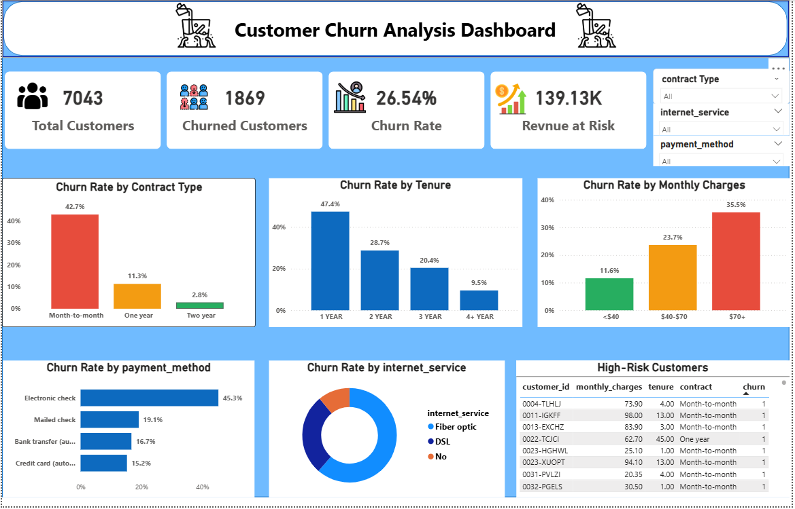

# 📊 Customer Churn Prediction & Analysis

## 🎯 Objective

The goal of this project is to identify customers who are likely to churn and provide actionable insights to reduce revenue loss. This project combines data analysis, SQL, machine learning, and dashboarding to deliver end-to-end business intelligence.

---

## 🛠️ Tech Stack

* **Python** (Pandas, NumPy, Scikit-learn)
* **MySQL** (Star Schema, Advanced SQL)
* **Power BI** (Dashboard & Visualization)
* **Jupyter Notebook**

---

## 📁 Project Structure

```
customer-churn-project/
│
├── data/
│   ├── raw/
│   │   └── telco_churn.csv
│   ├── cleaned/
│       └── cleaned_telco_churn.csv
│
├── notebook/
│   ├── data_cleaning.ipynb
│   ├── model_building.ipynb
│
├── sql/
│   ├── schema.sql
│   ├── churn_analysis.sql
│
├── dashboard/
│   └── churn_dashboard.pbix
│
└── README.md
```

---

## 🔄 Project Workflow

### 1️⃣ Data Collection

* Dataset loaded from Telco customer dataset

### 2️⃣ Data Cleaning (Python)

* Handled missing values
* Converted categorical variables
* Standardized column names
* Encoded target variable (Churn: Yes → 1, No → 0)

### 3️⃣ Feature Engineering

* Created tenure groups
* Created charge segments
* Prepared dataset for ML

### 4️⃣ SQL Data Modeling

* Created **Star Schema**

  * Fact Table: `fact_churn`
  * Dimension Tables: `dim_customer`, `dim_contract`, `dim_services`
* Performed advanced SQL analysis:

  * Churn rate calculation
  * Customer segmentation
  * Revenue at risk
  * Cohort analysis

### 5️⃣ Machine Learning

* Models used:

  * Logistic Regression
  * Random Forest
* Evaluation Metrics:

  * Accuracy
  * Precision
  * Recall
  * ROC-AUC
* Extracted **feature importance** to identify churn drivers

---

## 📊 Power BI Dashboard

### Key Features:

* KPI Cards:

  * Total Customers
  * Churn Rate
  * Revenue at Risk

* Churn Analysis:

  * By Contract Type
  * By Tenure
  * By Monthly Charges

* Advanced Insights:

  * Payment Method Analysis
  * Internet Service Distribution
  * High-Risk Customers Table

* Interactive Filters:

  * Contract Type

  * Internet Service
  * Payment Method


[](dashboard/dashboard.png)


--- 


## 🔍 Key Insights

* Customers with **month-to-month contracts** have the highest churn
* **New customers (0–1 year)** are more likely to churn
* Higher **monthly charges increase churn probability**
* Lack of **tech support** increases churn risk

---


## 💡 Conclusion

This project demonstrates an end-to-end data analytics workflow combining data engineering, analysis, machine learning, and visualization to solve a real-world business problem.

---
